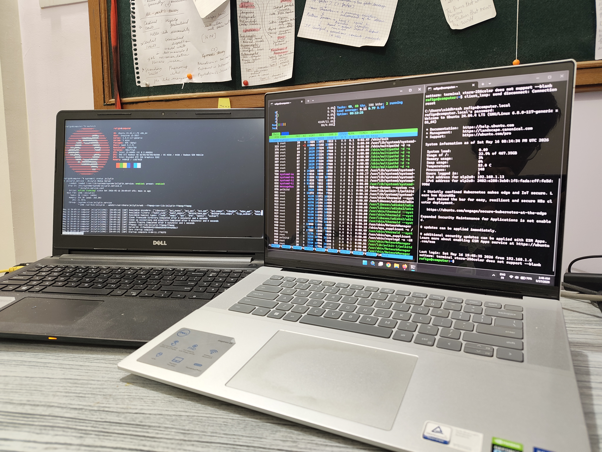
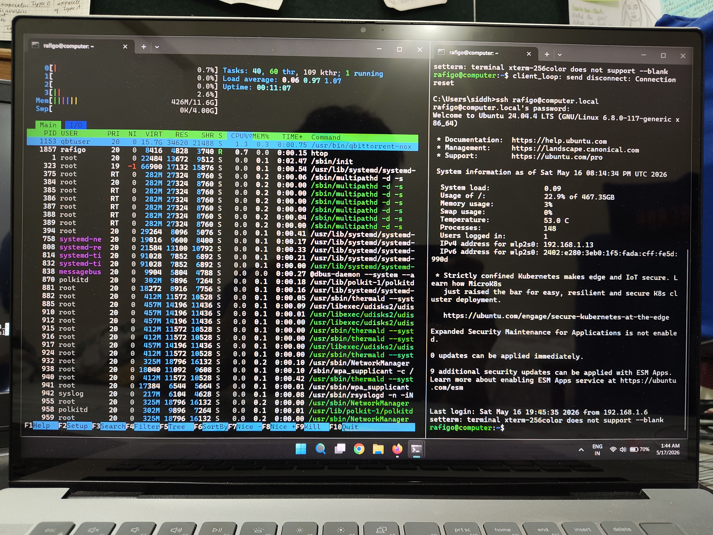
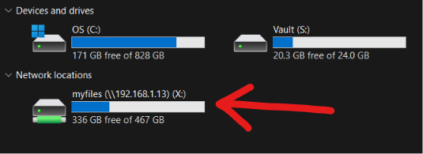
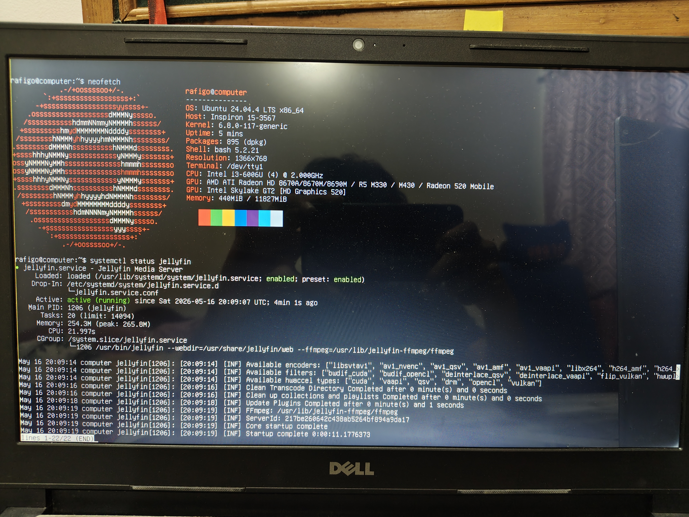
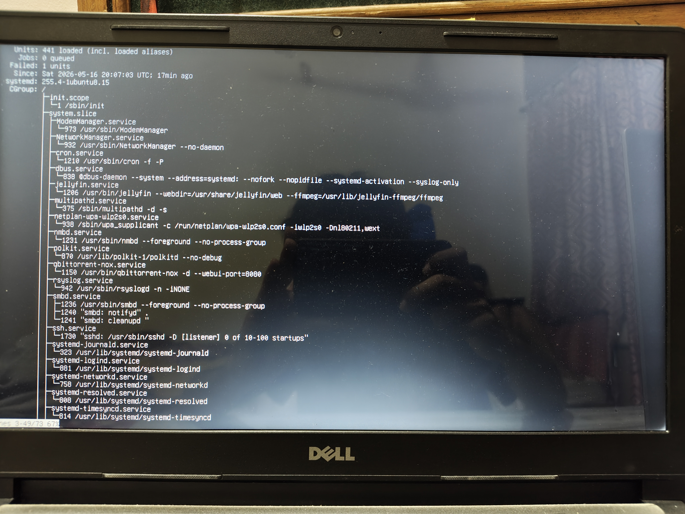

# Ubuntu Homelab NAS Server

A self-hosted Ubuntu Server setup built using a repurposed old laptop to provide NAS storage, media streaming, and remote administration services. This project focuses on extending the life of older hardware by transforming it into a functional homelab server, reducing electronic waste while exploring Linux system administration, self-hosting, networking, and lightweight server infrastructure.

---

# Features

- Runs on Ubuntu Server 24.04 LTS, which supports a wide range of applications 
- SSH remote administration for remote access to the server.
- Samba NAS configuration which can be accessed by any device on the local network (e.g. via network drive for Windows)
- Jellyfin media server to stream media content across all devices locally
- Headless server workflow for easier integration and faster response time
- Local hostname-based access

---

# Hardware

| Component | Details |
|---|---|
| Device | Dell Inspiron 15-3567 |
| CPU | Intel i3-6006U|
| RAM | 12 GB |
| Storage | 500 GB |
| OS | Ubuntu Server 24.04.4 LTS |

---

# Services

| Service | Purpose |
|---|---|
| SSH | Remote administration |
| Samba | NAS / file sharing |
| Jellyfin | Media streaming |

---

# Network Architecture

```text
Main PC
   │
   ├── SSH
   │
Router ─── Ubuntu Homelab Server
               ├── Samba NAS
               └── Jellyfin
```

---

# Learning Outcomes

- Linux server administration
- SSH remote management
- Samba configuration
- Media server deployment
- Self-hosting fundamentals
- Network service management

---

# Screenshots

## Setup



## System Monitoring and SSH login



## Samba NAS Access



The Samba share is mounted on a Windows machine over the local network.

## Details of Server and currently running services



## Active Services



---

# Future Improvements

- Docker containers
- VPN setup
- Automated backups
- Monitoring dashboard

---
